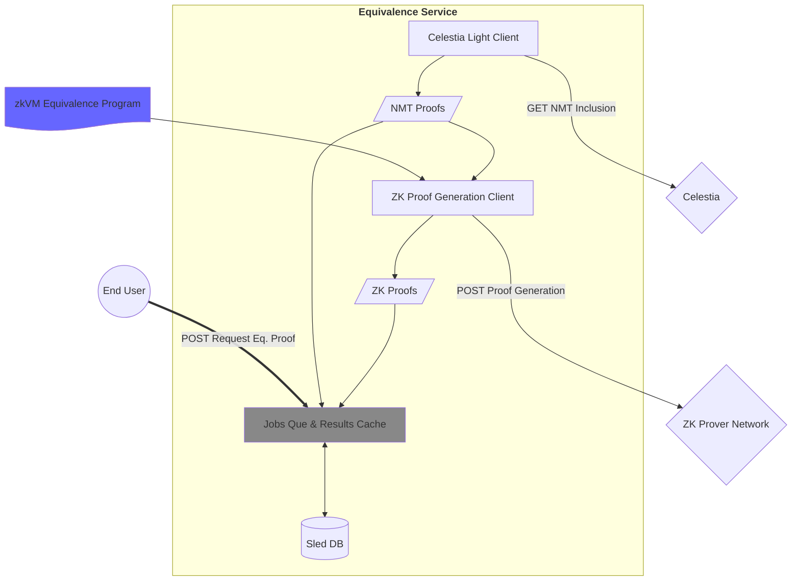

# Data Availability Equivalence Service

A gRPC service acting as a "cryptographic adapter" providing proofs that data (a blob) exists on [Celestia](https://celestia.org/) that are efficiently verifiable on EVM networks.
A [Namespace Merkle Tree (NMT)](https://celestia.org/glossary/namespaced-merkle-tree/) proof is transformed via a [Zero Knowledge Proof (ZKP)](https://docs.succinct.xyz/docs/sp1/what-is-a-zkvm) into a keccak hash check.

A few key features:

- On each request, a status is returned. Internally the service will dive each request to success or failure.
  - If a retryable failure is encountered, a subsequent request will attempt the job again.
  - It is normal and safe behavior to regularly repeat the same request for status updates and retries.
- The service eagerly caches work as it's completed, returning those results rather than redoing work.

**Jump to a section:**

- Send requests this service: [Interact](#interact)
- Spin up an instance of the service: [Operate](#operate)
- Build & troubleshoot: [Develop](#develop)

## Architecture



The service **_requires_** a connection to:

1. Celestia Data Availability (DA) Node to:
   - Fetch blob data.
   - Get headers.
   - Retrieve Merkle tree proofs for blobs.
1. [Succinct's prover network](https://docs.succinct.xyz/docs/sp1/generating-proofs/prover-network) as a provider to generate Zero-Knowledge Proofs (ZKPs) of data existing on Celestia.
   _See the [ZKP program](./program-keccak-inclusion/src/main.rs) for details on what is proven._

## Interact

Any gRPC client will do, integrating via the [`eqservice.proto` interface](./common/proto/eqservice.proto)

**The endpoint reports back a status, error, or success of a `Job` linked to identical request fields.**
Repeated requests will yield status updates and eventually a finalized proof or error status.

Here are examples using the [`grpcurl`](https://github.com/fullstorydev/grpcurl) CLI tool:

```sh
# Acquire the proto
curl https://raw.githubusercontent.com/celestiaorg/eq-service/refs/heads/main/common/proto/eqservice.proto --output eqservice.proto

# Local or remote instance of the eq-service
export EQ_SOCKET="127.0.0.1:50051"
# Where to find the proto file
export EQ_PROTO_DIR="."

# Example
# Fetching the Keccak inclusion proof for a specific Celestia commitment, namespace, and height
grpcurl -import-path $EQ_PROTO_DIR -proto eqservice.proto \
  -d '{height": <block height (integer)>", "namespace": "<your_namespace_hex>", commitment": "<your_commitment_hex>"}'
  -plaintext $EQ_SOCKET eqs.Inclusion.GetKeccakInclusion

# Working examples using Celestia's mocha network

# https://mocha.celenium.io/tx/e064ae79e06150ae75b37d3604c015d5698e173c52d0c2e3bf3203fe708e7513?tab=messages
grpcurl -import-path $EQ_PROTO_DIR -proto eqservice.proto \
  -d '{"height": 4214864, "namespace": "3q2+796tvu8=", "commitment":"YcARQRj9KE/7sSXd4090FAONKkPz9ajYKIZq8liv3A0="}' \
  -plaintext $EQ_SOCKET eqs.Inclusion.GetKeccakInclusion

# https://mocha.celenium.io/tx/c3c301fe579feb908fe02e2e8549c38f23707d30a3d4aa73e26402d854ff9104
grpcurl -import-path $EQ_PROTO_DIR -proto eqservice.proto \
  -d '{"height": 4409088, "namespace": "XSUTEfJbE6VJ4A==", "commitment":"DYoAZpU7FrviV7Ui/AjQv0BpxCwexPWaOW/hQVpEl/s="}' \
  -plaintext $EQ_SOCKET eqs.Inclusion.GetKeccakInclusion

# https://mocha.celenium.io/tx/6ead3f794b384a9f41f58e62be4d58822626add607eefcb7ab9f0dd6b70a6abe
grpcurl -import-path $EQ_PROTO_DIR -proto eqservice.proto \
  -d '{"height": 4499000, "namespace": "EV1P7ciRW7PodQ==", "commitment":"mV9udfLnkNqmG/3khk2/gH0wLPx/6RinVDCTV77X3Xw="}' \
  -plaintext $EQ_SOCKET eqs.Inclusion.GetKeccakInclusion

# https://mocha.celenium.io/tx/30a274a332e812df43cef70f395c413df191857ed581b68c44f05a3c5c322312
grpcurl -import-path $EQ_PROTO_DIR -proto eqservice.proto \
  -d '{"height": 4499999, "namespace": "Ucwac9Zflfa95g==", "commitment":"S2iIifIPdAjQ33KPeyfAga26FSF3IL11WsCGtJKSOTA="}' \
  -plaintext $EQ_SOCKET eqs.Inclusion.GetKeccakInclusion

# https://mocha.celenium.io/tx/36797fdd1faa19ef8df1a3d3ec1b0278eb784b0a8cc3d5cd94db10b254f3eb78
grpcurl -import-path $EQ_PROTO_DIR -proto eqservice.proto \
  -d '{"height": 6692080, "namespace": "XSUTEfJbE6VJ4A==", "commitment":"iu5d9b+rtl5B/j2ju3hUqbJT0y/kcUV4gHUdCvU2Jn4="}' \
  -plaintext $EQ_SOCKET eqs.Inclusion.GetKeccakInclusion
```

## Operate

Most users will want to pull and run this service using Docker or Podman via container registry, see [running containers](#running-containers).

To build and run, see [developing instructions](#develop)

### Requirements

1. A machine to run with a _minimum_ of:

   - 2 threads
   - 2GB RAM
   - Ports accessible (by default):
     - service listening at `50051`
     - Light client (local or remote) over `26658`
     - Succinct prover network over `443`
   - **NOTE:** These requirements may be significantly more to respond under heavy load, please report if you have issues!

1. A whitelisted key in your `env` for use with the Succinct prover network Key - [requested here](https://docs.succinct.xyz/docs/sp1/generating-proofs/prover-network).

1. A Celestia Light Node [installed](https://docs.celestia.org/how-to-guides/celestia-node) & [running](https://docs.celestia.org/tutorials/node-tutorial#auth-token) accessible on `localhost`, or elsewhere.
   Alternatively, use [an RPC provider](https://github.com/celestiaorg/awesome-celestia/?tab=readme-ov-file#node-operator-contributions) you trust.

### Configure

Required and optional settings are best configured via a `.env` file. See [`example.env`](./example.env) for configurable items.

```sh
cp example.env .env

# edit .env
```

### Running containers

The images are available:

1. <https://ghcr.io/celestiaorg/eq-service>
1. <https://hub.docker.com/r/celestiaorg/eq-service>

```sh
# ghcr:
docker pull ghcr.io/celestiaorg/eq-service:latest

# Docker hub:
docker pull celestiaorg/eq-service:latest
```

_Don't forget you need to [configure your environment](#configure)_.

### Metrics and Alerts

This service exposes a HTTP endpoint at `/metrics` that you can connect to [Prometeus](https://prometheus.io/) for service monitoring, alerts, and more.

With the eq-service running locally (on metal, not in a container), you can connect a development only(!) server by using:

```sh
docker run -d \
  --network="host" \
  -p 127.0.0.1:9090:9090 \
  -v $(pwd)/infra/prometheus.yml:/etc/prometheus/prometheus.yml \
  prom/prometheus
```

## Develop

First, some tooling is required:

1. Rust & Cargo - [install instructions](https://www.rust-lang.org/tools/install)
1. Succinct's SP1 zkVM Toolchain - [install instructions](https://docs.succinct.xyz/docs/sp1/getting-started/install)
1. Protocol Buffers (Protobuf) compiler - [official examples](https://github.com/hyperium/tonic/tree/master/examples#examples) contain install instructions
1. (Optional) Just - a modern alternative to `make` [installed](https://just.systems/man/en/packages.html)

Then:

1. Clone the repo

   ```sh
   git clone https://github.com/your-repo-name/eq-service.git
   cd eq-service
   ```

1. Choose a Celestia Node

   - See the [How-to-guides on nodes](https://docs.celestia.org/how-to-guides/light-node) to run one yourself, or choose a provider & set in `env`.
   - **NOTE:** You _must_ have the node synced back to the oldest possible height you may encounter in calling this service for it to fulfill that request.

1. [Configure required env variables](#configure)

1. Build and run the service
   ```sh
   # NOT optimized, default includes debug logs printed
   just run-debug
   # Optimized build, to test realistic performance w/ INFO logs
   just run-release
   ```

There are many other helper scripts exposed in the [justfile](./justfile), get a list with:

```
# Print just recipes
just
```

### Containerization

Docker and [Podman](https://podman.io/) are configured in [Dockerfile](./Dockerfile) to build an image with that includes a few caching layers to minimize development time & final image size -> publish where possible. To build and run in a container:

```sh
# Using just
just docker-build
just docker-run


# Manually

## Build
[docker|podman] build -t eq_service .

## Setup
source .env
mkdir -p $EQ_DB_PATH

## Run (example)
[docker|podman] run --rm -it -v $EQ_DB_PATH:$EQ_DB_PATH --env-file .env --env RUST_LOG=eq_service=debug --network=host -p $EQ_PORT:$EQ_PORT eq_service
```

Importantly, the DB should persist, and the container must have access to connect to the DA light client (likely port 26658) and Succinct network ports (HTTPS over 443).

The images are built and published for [releases](https://github.com/celestiaorg/eq-service/releases) - see [running containers](#running-containers) for how to pull them.

## License

[MIT License](./LICENSE)
